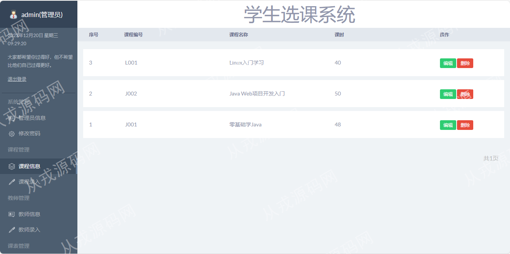
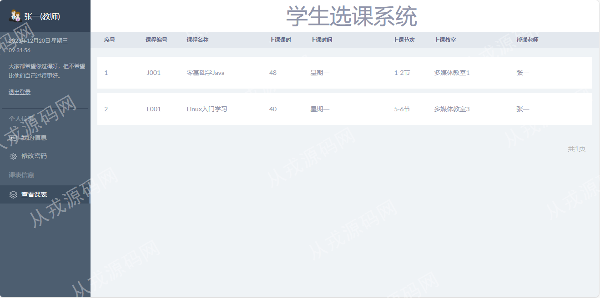

<h1 align="center">59.学生选课管理系统</h1>

- <b>完整代码获取地址：从戎源码网 ([https://armycodes.com/](https://armycodes.com/))</b>
- <b>技术探讨、资料分享，请加QQ群：692619798</b> 
- <b>作者微信：19941326836  QQ：952045282</b> 
- <b>承接计算机毕业设计、Java毕业设计、Python毕业设计、深度学习、机器学习</b>
- <b>选题+开题报告+任务书+程序定制+安装调试+论文+答辩ppt 一条龙服务</b>
- <b>所有选题地址 ([https://github.com/YuLin-Coder/AllProjectCatalog](https://github.com/YuLin-Coder/AllProjectCatalog)) </b>

## 项目介绍
基于servlet+jsp的学生选课管理系统：前端jsp、jquery、bootstrap，后端 servlet、jdbc，集成课程管理、教师管理、课表管理、我的选课等功能于一体的系统。

## 功能介绍

### 管理员

- 管理员信息：管理员账号的增删查、密码修改
- 课程管理：课程信息的增删改查
- 教师管理：教师信息的增删改查，教师信息录入时，需要设置用于教师登录的系统的账号和密码信息
- 课表管理：课表信息的增删改查，课表信息录入时，是基于系统现有的课程信息和教师信息来录入的，在录入课表信息前需要先录入课程信息和教师信息

### 教师

- 我的信息：个人信息查看、密码修改
- 课表信息：查看课表，只能查看到和自己相关的课表信息
- 
### 学生

- 我的信息：个人信息查看、密码修改
- 课表信息：课表信息列表、我的选课、选择课程

## 环境

- <b>IntelliJ IDEA 2021.3</b>

- <b>Mysql 5.7.26</b>

- <b>Tomcat 7.0.73</b>

- <b>JDK 1.8</b>

## 运行截图

